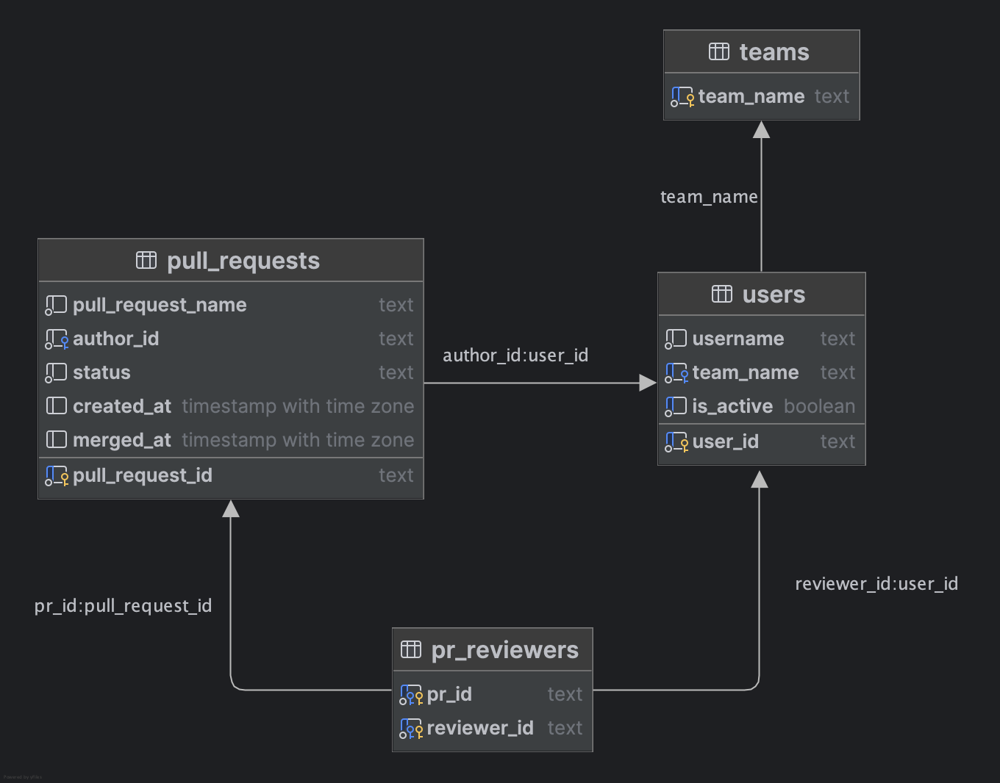

# Сервис назначения ревьюеров для Pull Request’ов

Назначает ревьюеров на PR из команды автора, позволяет выполнять переназначение ревьюверов и получать список PR’ов, назначенных конкретному пользователю, а также управлять командами и активностью пользователей.

## Установка и запуск проекта
### 1. **Клонируйте проект**
```bash
git clone https://github.com/platonso/avito-pr-service.git
```
### 2. Запустите
####  С использованием Docker Compose

```bash
docker compose up
```

#### С использованием Makefile

```bash
make up     # собрать и запустить контейнеры
make down   # остановить и удалить контейнеры
```
После запуска сервис будет доступен:

- HTTP API: http://localhost:8080

## Реализованный функционал

#### Команды (Teams)
- POST /team/add - Создать команду с участниками
- GET /team/get - Получить команду по имени

#### Пользователи (Users)
- POST /users/setIsActive - Включить/выключить пользователя
- GET /users/getReview - Получить PR где пользователь ревьювер

#### Pull Requests (PR)
- POST /pullRequest/create - Создать PR и автоматически назначить до 2 ревьюверов из команды автора
- POST /pullRequest/merge - Замержить PR
- POST /pullRequest/reassign - Заменить ревьювера на другого из его команды

#### Статистика (Stats)
- GET /stats/reviewers - Статистика по ревьюверам
- GET /stats/pullRequests - Статистика по Pull Request'ам

## Cхема базы данных


- `teams` - названия команд
- `pull_requests` - основные данные PR (название, статус, даты, автор)
- `users` - информация об авторах и ревьюверах  
- `pr_reviewers` - связь PR с назначенными ревьюверами

## Тестирование
### Unit-тесты
Бизнес логика покрыта модульными тестами. Покрытие по доменным областям:
* Team `100%`
* User `100%`
* Pull request `71.1%`

Можно запустить тесты и увидеть покрытие при помощи команды:

```bash
make cover
```

## Стек технологий

*   **Язык:** Go 1.25.1
*   **База данных:** PostgreSQL
*   **Контейнеризация:** Docker, Docker Compose
*   **Библиотеки:**  gin, pgx, goose, cleanenv